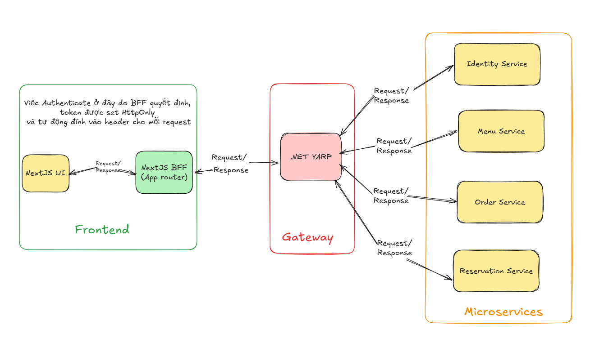
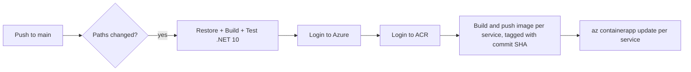

# 🍽️ RestaurantQR — Fullstack QR Ordering Platform

> Guests scan a QR code at their table to order — no app install required. Staff run the entire restaurant from a real-time admin dashboard. Built on a Next.js frontend and a .NET microservices backend, deployed to Vercel and Azure.

---

## Table of Contents

- [Overview](#-overview)
- [Features](#-features)
- [System Architecture](#-system-architecture)
- [Tech Stack](#-tech-stack)
- [Cloud Deployment](#-cloud-deployment)
- [CI/CD Pipeline](#-cicd-pipeline)
- [Docker & Local Development](#-docker--local-development)
- [Database Architecture](#-database-architecture)
- [Authentication & Authorization](#-authentication--authorization)
- [API Reference](#-api-reference)
- [Internationalization](#-internationalization-i18n)
- [Security Considerations](#-security-considerations)
- [Performance](#-performance)
- [Testing](#-testing)
- [Getting Started](#-getting-started)
- [Project Structure](#-project-structure)
- [Troubleshooting](#-troubleshooting)
- [Known Issues / Roadmap](#-known-issues--roadmap)
- [License & Author](#-license--author)

---

## 📖 Overview

RestaurantQR is a fullstack restaurant management platform built around QR-code ordering:

- **Guests** scan a QR code at their table → browse the live menu in-browser → order → track status in real time — no account or app install needed.
- **Staff** manage dishes, tables, orders, reservations, and accounts through a role-based admin dashboard with live updates.
- **The public** can browse an interactive floor plan and book a table without logging in.

The system is split into two independently deployed parts that communicate over a REST/WebSocket API:

| Part         | Stack                                 | Deployment           |
| ------------ | ------------------------------------- | -------------------- |
| **Frontend** | Next.js 16 (App Router)               | Vercel               |
| **Backend**  | 4 .NET 10 microservices + API Gateway | Azure Container Apps |

---

## ✨ Features

### Guest ordering (QR flow)

- Scan a table's QR code, or use the in-browser scanner → lands on `/table/{tableId}/welcome`
- Enter a name to start a session — no account or password
- Browse the live menu, filter by category, build a cart, place an order
- Track order status in real time (**Pending → Preparing → Served**) via SignalR
- Request the bill directly from the order-status page

### Public reservation

- Browse an interactive floor plan and pick a table, or let the restaurant assign one
- Submit a booking with name, phone, date/time, and party size — no login required

### Admin dashboard (Staff / Admin / SuperAdmin)

- **Dashboard** — revenue, order and table metrics, revenue/top-dish charts, recent orders
- **Dishes** — CRUD, image upload, category/status management
- **Orders** — real-time order board grouped by table + guest, per-item and bulk status updates
- **Tables** — CRUD, QR code generation/reset, live status (Available / Occupied / Hidden)
- **Accounts** — role-based staff management (SuperAdmin creates Admins, Admin creates Staff)
- **Reservations** — manage incoming bookings: check-in, deposit, cancellation flow
- **Settings** — profile and password management

### Backend capabilities

- Menu management with price-history snapshots (an order always reflects the price at the time it was placed, even if the dish price later changes)
- Table-based ordering with guest session tracking
- Reservation system backed by MongoDB
- JWT authentication with role-based access control (SuperAdmin / Admin / Staff), plus a separate short-lived guest token scheme
- Per-table bill generation and payment tracking
- Rate limiting on sensitive endpoints (login: 5 req/min per IP)

---

## 🏗️ System Architecture



### Microservices breakdown

| Service             | Port | Database                  | Responsibility                                                                                       |
| ------------------- | ---- | ------------------------- | ---------------------------------------------------------------------------------------------------- |
| **Gateway.API**     | 3000 | —                         | Single entry point; routes requests to the right microservice via YARP; JWT validation & propagation |
| **Identity.API**    | 3001 | SQL Server (`IdentityDb`) | Account registration/login, JWT + refresh token issuance, RBAC                                       |
| **Menu.API**        | 3002 | SQL Server (`MenuDb`)     | Dish CRUD, price-history snapshots, image upload                                                     |
| **Order.API**       | 3003 | SQL Server (`OrderDb`)    | Tables, guest sessions, orders, bills, real-time updates via SignalR (`OrderHub`)                    |
| **Reservation.API** | 3004 | MongoDB (`ReservationDb`) | Table reservations, availability                                                                     |

**Design decisions:**

- **BFF pattern (frontend)**: the browser never talks to the backend directly. Next.js Route Handlers own authentication and hold tokens as `httpOnly` cookies — the browser never sees a raw JWT.
- **API Gateway (backend)**: a single YARP entry point decouples the frontend from internal service topology; services can be split, merged, or rescaled without the frontend knowing.
- **Polyglot persistence**: SQL Server for relational data (accounts, menu, orders/bills), MongoDB for reservations — chosen per service's data shape rather than forcing a single database for everything.
- **Price snapshots**: `Order.API` calls `Menu.API` to create a `DishSnapshot` at order time, so historical orders/bills stay accurate even if a dish's price changes later.
- **Real-time updates**: SignalR pushes order status changes to guests and staff without polling.

---

## ⚙️ Tech Stack

### Frontend

| Concern               | Technology                                    |
| --------------------- | --------------------------------------------- |
| Framework             | Next.js 16 (App Router, Turbopack)            |
| Language              | TypeScript                                    |
| Styling               | Tailwind CSS v4 + custom design tokens        |
| UI Components         | shadcn/ui + Radix UI primitives               |
| Data fetching / cache | TanStack Query v5                             |
| Forms & validation    | React Hook Form + Zod                         |
| i18n                  | next-intl                                     |
| Real-time             | @microsoft/signalr                            |
| Charts                | Recharts                                      |
| QR codes              | qrcode.react, html5-qrcode (scanner)          |
| HTTP layer            | Custom `src/lib/http.ts` wrapper over `fetch` |
| Notifications         | Sonner (toast)                                |
| Deployment            | **Vercel**                                    |

### Backend

| Concern          | Technology                                                |
| ---------------- | --------------------------------------------------------- |
| Framework        | .NET 10 / C# 14                                           |
| API Gateway      | YARP.ReverseProxy 2.3.0                                   |
| ORM              | Entity Framework Core 10.0.6                              |
| Relational DB    | SQL Server 2019+                                          |
| Document DB      | MongoDB 5.0+ (driver 3.1.0)                               |
| Authentication   | JWT Bearer, BCrypt.Net-Next (password hashing)            |
| Real-time        | SignalR                                                   |
| Logging          | Serilog + Azure Application Insights                      |
| Health Checks    | AspNetCore.HealthChecks (SQL Server, MongoDB)             |
| API Docs         | Swagger / OpenAPI                                         |
| Containerization | Docker (per-service Dockerfile)                           |
| Deployment       | **Azure Container Apps** via **Azure Container Registry** |

---

## ☁️ Cloud Deployment

### Frontend → Vercel

The Next.js app deploys on **Vercel** via native Git integration: every push to `main` triggers an automatic production build, and every pull request gets its own preview deployment. Vercel also handles edge caching and the image-optimization pipeline.

### Backend → Azure

| Component         | Azure Service                                               | Purpose                                                                        |
| ----------------- | ----------------------------------------------------------- | ------------------------------------------------------------------------------ |
| Container images  | **Azure Container Registry** (`restaurantqracr.azurecr.io`) | Stores versioned Docker images, one per microservice                           |
| Compute           | **Azure Container Apps**                                    | Runs each microservice as an independently scalable container                  |
| Dish images       | **Azure Files** (mounted volume)                            | Persistent storage for uploaded dish photos, shared across `Menu.API` replicas |
| Resource grouping | Resource Group `RestaurantQR-RG`                            | Groups all backend resources for lifecycle management                          |
| Monitoring        | Azure Monitor / Application Insights                        | Centralized logging (via Serilog sink) and OpenTelemetry tracing               |

**Why Container Apps over AKS:** the backend is five small services that need independent scaling and simple container deployment, but not the operational overhead of managing a full Kubernetes cluster. Container Apps provides per-service autoscaling and revision-based rollouts with a much smaller ops footprint — the right fit for this project's scale.

Each microservice runs as its own Container App and is updated independently through the CI/CD pipeline below.

---

## 🔄 CI/CD Pipeline

### Backend — GitHub Actions



- Workflow: `backend/.github/workflows/deploy-backend.yml`
- Triggered only when relevant paths change (`src/**`, `Gateway.API/**`, `BuildingBlocks/**`) — unrelated commits don't trigger a redeploy
- Runs `dotnet test` before any deployment step; a failing test blocks the release
- Uses a build matrix to deploy all 5 services in parallel: `identity-api`, `menu-api`, `order-api`, `reservation-api`, `gateway`
- Each image is tagged with the Git commit SHA, so a running revision can always be traced back to its exact source commit

### Frontend

Deployed via **Vercel's native Git integration** — no custom GitHub Actions workflow needed. Every push to `main` triggers an automatic build/deploy; pull requests get preview URLs.

> 🔜 Planned: a lightweight Actions workflow to run lint/type-check before Vercel's build, catching issues earlier in PR review.

---

## 🐳 Docker & Local Development

`backend/docker-compose.yml` orchestrates the full stack for local development:

```yaml
services:
  sqlserver        # SQL Server 2022
  mongodb          # MongoDB 7
  identity-api     # Auth & accounts       — :3001
  menu-api         # Dishes & pricing      — :3002
  order-api        # Orders & tables       — :5219
  reservation-api  # Reservations          — :3004
  gateway          # YARP API Gateway      — :5000
  frontend         # Next.js app           — :4000
```

Healthchecks and explicit `depends_on` ordering ensure services start in dependency order — e.g. `order-api` waits for `sqlserver` to report **healthy**, not just "started".

```bash
cd backend
cp .env.example .env   # fill in JWT secrets & DB passwords
docker-compose up -d
```

> **Note:** the `frontend` service expects a `Dockerfile` at `frontend/Dockerfile`, used only for full-stack local testing. In production the frontend runs on Vercel instead.

Each backend service also ships its own standalone `Dockerfile` and can be built individually:

```bash
docker build -f Gateway.API/Dockerfile -t gateway-api:latest .
docker build -f src/Services/Identity.API/Dockerfile -t identity-api:latest .
docker build -f src/Services/Menu.API/Dockerfile -t menu-api:latest .
docker build -f src/Services/Order.API/Dockerfile -t order-api:latest .
docker build -f src/Services/Reservation.API/Dockerfile -t reservation-api:latest .
```

---

## 📊 Database Architecture

### SQL Server — `IdentityDb`

```
Accounts          Id (PK), Email (unique), Name, Role (SuperAdmin/Admin/Staff), Password (hashed), CreatedAt, UpdatedAt
RefreshTokens      Id (PK), AccountId (FK), Token, ExpiresAt, RevokedAt (nullable)
```

### SQL Server — `MenuDb`

```
Dishes            Id (PK), Name, Description, Price, Category, ImagePath, IsAvailable, CreatedAt, UpdatedAt
DishSnapshots      Id (PK), DishId (FK), Price (at order time), Name, CreatedAt
```

### SQL Server — `OrderDb`

```
Tables            Id (PK), TableNumber (unique), Capacity, Status (Available/Occupied/Reserved), UpdatedAt
Guests            Id (PK), TableId (FK), Name, SessionId, CreatedAt, UpdatedAt
Orders            Id (PK), GuestId (FK), TableId (FK), DishSnapshotId (FK), Quantity,
                  Status (Pending/Preparing/Served/Cancelled), Notes, CreatedAt, UpdatedAt
Bills             Id (PK), TableId (FK), TotalAmount, Status (Open/Paid/Cancelled),
                  PaymentMethod, CreatedAt, UpdatedAt   [indexed on TableId, Status]
```

### MongoDB — `ReservationDb`

```json
{
  "_id": "ObjectId",
  "guestName": "string",
  "guestEmail": "string",
  "guestPhone": "string",
  "reservationDate": "DateTime",
  "numberOfGuests": "int",
  "tableNumber": "int",
  "notes": "string",
  "status": "Confirmed | Cancelled | Completed",
  "createdAt": "DateTime",
  "updatedAt": "DateTime"
}
```

---

## 🔐 Authentication & Authorization

Authentication spans both the frontend (BFF) and backend (Identity service):

1. The browser calls a Next.js Route Handler (e.g. `POST /api/auth/login`) — **never** the microservices directly.
2. The Route Handler calls `Identity.API` through the Gateway, receives an access/refresh token pair, and stores them as `httpOnly`, `secure` cookies.
3. `src/middleware.ts` reads those cookies on every request to `/admin/*`: no refresh token → redirect to `/login`; expired access token but valid refresh token → silently refresh; valid token → check role before allowing access.
4. **Guests** get a separate, short-lived token (`GuestAccess`, different signing secret) issued by `POST /guest/login`, scoped to a single table session (`sessionId`). Resetting a table invalidates every outstanding guest token instantly.

**Token payloads:**

|          | Staff AccessToken (Identity.API)            | Guest Token (Order.API)       |
| -------- | ------------------------------------------- | ----------------------------- |
| Subject  | Account email                               | Guest ID                      |
| Claims   | `role`, `email`                             | `sessionId`, `table`          |
| Lifetime | Configurable (default 60 min)               | Short-lived, configurable     |
| Refresh  | Yes, rotating refresh token (7-day default) | No — re-issued on table reset |

**Rate limiting:** login endpoint capped at 5 requests/minute per IP; general API at 100 requests/minute per IP, returning a `Retry-After` header when exceeded.

---

## 📡 API Reference

### Identity.API (`/api/v1`)

| Method | Path                  | Description                   |
| ------ | --------------------- | ----------------------------- |
| POST   | `/auth/login`         | User login                    |
| POST   | `/auth/refresh-token` | Refresh access token          |
| GET    | `/accounts`           | List accounts _(Admin only)_  |
| POST   | `/accounts/register`  | Register new account          |
| DELETE | `/accounts/{id}`      | Delete account _(Admin only)_ |

### Menu.API (`/api/v1`)

| Method | Path                 | Description                   |
| ------ | -------------------- | ----------------------------- |
| GET    | `/dishes`            | List all dishes               |
| GET    | `/dishes/{id}`       | Get dish by ID                |
| POST   | `/dishes`            | Create dish _(auth required)_ |
| PUT    | `/dishes/{id}`       | Update dish _(auth required)_ |
| DELETE | `/dishes/{id}`       | Delete dish _(auth required)_ |
| POST   | `/dishes/{id}/image` | Upload dish image             |

### Order.API (`/api/v1`)

| Method           | Path                      | Description                              |
| ---------------- | ------------------------- | ---------------------------------------- |
| GET / POST / PUT | `/tables`                 | Table CRUD _(auth required)_             |
| GET              | `/guests`                 | List guests                              |
| POST             | `/guests/login`           | QR guest login → issues guest token      |
| POST             | `/orders`                 | Create order _(guest or staff token)_    |
| GET              | `/orders/table/{tableId}` | Get orders for a table _(auth required)_ |
| PUT              | `/orders/{id}`            | Update order _(auth required)_           |
| GET              | `/bills/table/{tableId}`  | Get bills by table _(auth required)_     |
| POST             | `/bills/{tableId}`        | Create bill _(auth required)_            |
| PUT              | `/bills/{id}/pay`         | Mark bill as paid _(auth required)_      |
| WS               | `/orderHub`               | Real-time order updates (SignalR)        |

### Reservation.API (`/api/v1`)

| Method | Path                 | Description           |
| ------ | -------------------- | --------------------- |
| GET    | `/reservations`      | List reservations     |
| POST   | `/reservations`      | Create reservation    |
| GET    | `/reservations/{id}` | Get reservation by ID |
| PUT    | `/reservations/{id}` | Update reservation    |
| DELETE | `/reservations/{id}` | Cancel reservation    |

Every backend service also exposes `GET /health` (liveness), `GET /health/ready` (readiness, includes DB check), and `GET /openapi/v1.json` (Swagger spec).

---

## 🌐 Internationalization (i18n)

The frontend is fully bilingual (`vi` default, `en`) via [`next-intl`](https://next-intl.dev):

- Every route lives under `src/app/[locale]/...`; `middleware.ts` detects/redirects to a locale prefix **before** running auth checks, and preserves the locale through every redirect.
- Translation strings live in `messages/vi.json` and `messages/en.json`, namespaced by area (`HomePage`, `LoginPage`, `AdminNav`, `Admin.*`, `Guest.*`).
- Server Components read translations via `getTranslations`; Client Components use the `useTranslations` hook.
- A locale switcher lets users change language while staying on the same page.

---

## 🔒 Security Considerations

- JWT signed with strong secrets (min 32 characters); separate signing secrets for staff and guest tokens
- Refresh token rotation on the staff auth flow
- Role-based access control (SuperAdmin / Admin / Staff) enforced at the API layer
- Passwords hashed with BCrypt
- HTTPS enforced in production
- EF Core parameterized queries (no raw SQL string concatenation)
- Rate limiting on login and general API traffic

**Production recommendations (partially implemented / roadmap):**

- Move JWT secrets to Azure Key Vault instead of environment variables
- Restrict CORS to known origins — currently open across all backend services (see [Known Issues](#-known-issues--roadmap))
- Enable database encryption at rest
- Add API versioning for backward compatibility as the system grows

---

## 📈 Performance

**Backend**

- EF Core connection pooling; explicit (non-lazy) loading to avoid N+1 queries
- YARP-level request routing with room to add response caching
- Fast liveness probes (no DB round-trip) vs. comprehensive readiness probes (include DB health)

**Frontend**

- Turbopack used for both `next dev` and `next build` (Next.js 16), reducing build times over the legacy Webpack pipeline
- Automatic route-level code splitting via the App Router — each admin page and guest-flow step ships its own chunk
- To inspect and optimize bundle size further:
  ```bash
  npm install --save-dev @next/bundle-analyzer
  ANALYZE=true npm run build
  ```
  _(Not yet wired into `next.config.mjs` — recommended follow-up, with baseline bundle sizes per route documented here once measured.)_

---

## 🧪 Testing

```bash
# Per-service backend tests
cd backend/tests/Identity.API.Tests && dotnet test
cd backend/tests/Menu.API.Tests && dotnet test
cd backend/tests/Order.API.Tests && dotnet test
cd backend/tests/Reservation.API.Tests && dotnet test

# All backend tests
cd backend && dotnet test --no-build

# Frontend lint
cd frontend && npm run lint
```

Each backend test project includes unit tests for service logic and integration tests for API endpoints, with external dependencies mocked.

---

## 🚀 Getting Started

### Prerequisites

- Node.js 20+, npm
- .NET 10 SDK
- Docker & Docker Compose
- SQL Server 2019+ and MongoDB 5.0+ (or use Docker Compose for both)

### Frontend

```bash
cd frontend
npm install
cp .env.example .env   # see Environment Variables below
npm run dev             # http://localhost:4000
```

**Environment variables:**

```bash
# Public (bundled into the browser)
NEXT_PUBLIC_URL=http://localhost:4000
NEXT_PUBLIC_SIGNALR_ORDER=<gateway-url>
NEXT_PUBLIC_MENU_ASSETS_URL=<gateway-url>
NEXT_PUBLIC_GA_ID=<google-analytics-id>   # optional

# Server-only (read by BFF route handlers / middleware)
IDENTITY_API_URL=<gateway-url>/api/v1
MENU_API_URL=<gateway-url>/api/v1
ORDER_API_URL=<gateway-url>/api/v1
RESERVATION_API_URL=<gateway-url>/api/v1
API_GATEWAY_URL=<gateway-url>/api/v1
```

> All four `*_API_URL` variables typically point to the same Gateway host, which routes to the correct service by path prefix.

### Backend — full stack via Docker Compose

```bash
cd backend
cp .env.example .env
docker-compose up -d
```

### Backend — individual services (no Docker)

```bash
cd backend/Gateway.API && dotnet run
cd backend/src/Services/Identity.API && dotnet run
cd backend/src/Services/Menu.API && dotnet run
cd backend/src/Services/Order.API && dotnet run
cd backend/src/Services/Reservation.API && dotnet run
```

Run migrations before first start (SQL Server-backed services only):

```bash
cd backend/src/Services/Identity.API && dotnet ef database update
cd backend/src/Services/Menu.API && dotnet ef database update
cd backend/src/Services/Order.API && dotnet ef database update
# Reservation.API uses MongoDB — no migrations needed
```

---

## 📁 Project Structure

```
RestaurantQR-Fullstack/
├── frontend/                     # Next.js 16 — guest UI + admin dashboard
│   ├── src/
│   │   ├── app/
│   │   │   ├── [locale]/         # Landing, login, guest flow, admin dashboard
│   │   │   └── api/              # BFF route handlers (auth, proxy to gateway)
│   │   ├── i18n/                 # next-intl routing & config
│   │   ├── components/           # Shared UI, admin shell, charts
│   │   ├── queries/               # TanStack Query hooks per domain
│   │   ├── apiRequests/           # Typed request functions
│   │   ├── schema/                # Zod schemas (validation & types)
│   │   ├── lib/                   # http client, utils, guest session helpers
│   │   ├── hooks/                 # SignalR hook, token refresh hook
│   │   └── middleware.ts          # Locale routing + auth guarding
│   ├── messages/{en,vi}.json
│   └── README.md
│
├── backend/                      # .NET 10 microservices
│   ├── Gateway.API/               # YARP reverse proxy — single entry point
│   ├── src/Services/
│   │   ├── Identity.API/          # Auth, accounts, JWT     (Domain/Application/Infrastructure/API)
│   │   ├── Menu.API/              # Dishes, pricing, images
│   │   ├── Order.API/             # Tables, orders, bills, SignalR
│   │   └── Reservation.API/       # Reservations (MongoDB)
│   ├── BuildingBlocks/            # Shared library across services
│   ├── tests/                     # Unit + integration tests per service
│   ├── docker-compose.yml
│   └── README.md
│
└── README.md                      # this file
```

Each backend service follows the same internal layering: `Domain/Entities` → `Application/Services` + `DTOs` → `Infrastructure/Persistence` (EF Core / Mongo context) → `API/Controllers` + `Middleware`.

---

## 📄 License & Author

Licensed under the **MIT License** — commercial use, modification, distribution, and private use are all permitted; requires preserving the license and copyright notice.

**Author:** deV-inh08
**GitHub:** [github.com/deV-inh08](https://github.com/deV-inh08)
